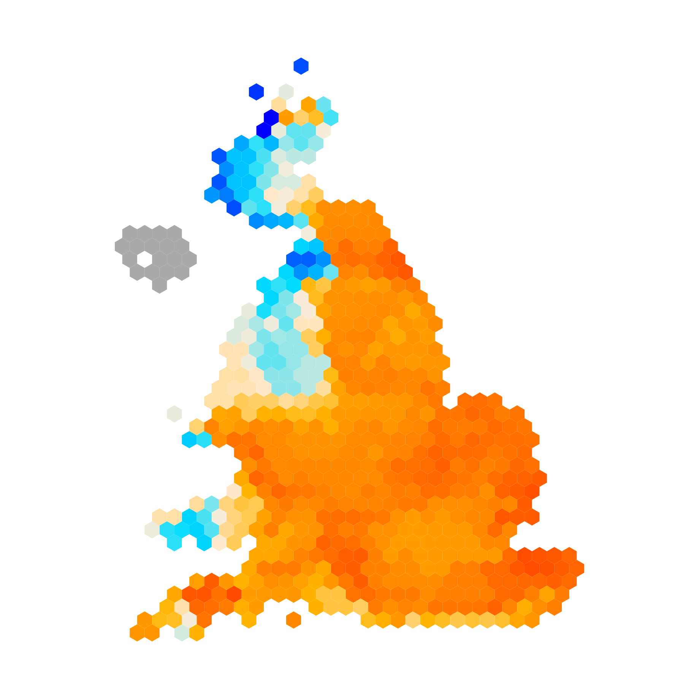

# climate hexmaps

This repository makes some hexmaps of climate features. It uses HadUK-Grid observations and UKCP18-12km projections. 

The kind of thing that I'm thinking of is:

A link to an the interactive hexmap maker can be found [https://open-innovations.org/projects/hexmaps/builder.html?https://docs.google.com/spreadsheets/d/1F3WGCFrgMu9CDftGO0khXPwnoEIkuv4Zn2v8Hh2ngFg/gviz/tq?tqx=out:csv&colourscale=Planck&borders=false&attribute=drought_day_change_2065&labels=false](https://open-innovations.org/projects/hexmaps/builder.html?https://docs.google.com/spreadsheets/d/1F3WGCFrgMu9CDftGO0khXPwnoEIkuv4Zn2v8Hh2ngFg/gviz/tq?tqx=out:csv&colourscale=Planck&borders=false&attribute=drought_day_change_2065&labels=false)

